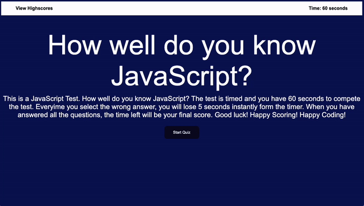

# JavaScript Test

## Table of Contents

- [Description](#description)
- [User Story](#user-story)
- [Acceptance Criteria](#acceptance-criteria)
- [Images](#images) 
- [Link To Deployed Webpage on GitHub](#link-url-to-deployed-webpage-on-github)
- [Installation](#installation)
- [Technologies Used](#technologies-used)
- [Credits](#credits)
- [License](#license)

## Description

The goal of this web application was to use the skills we learned with WEB APIs to create a timed JavaScript Test. The user will have 60 seconds to complete the test. The test has a total of 5 questions with mutliple choice answers. Everytime the use chooses the incorrect answer, the will lose 5 seconds from the countdown. Once completed, the user can enter their initials, hit the submit and view their scores. The faster they are the better higher the score.

The technical skills needed was to show the use of arrays, eventlisteners, array objects, call back functions,time inntervals, for loop functions, condtional statements, DOM manipulation, consol.log to see bugs in our code via the consol in the google inspect, etc.

## User Story
- AS A coding boot camp student
- I WANT to take a timed quiz on JavaScript fundamentals that stores high scores
- SO THAT I can gauge my progress compared to my peers

## Acceptance Criteria
 - GIVEN I am taking a code quiz
- WHEN I click the start button
- THEN a timer starts and I am presented with a question
- WHEN I answer a question
- THEN I am presented with another question
- WHEN I answer a question incorrectly
- THEN time is subtracted from the clock
- WHEN all questions are answered or the timer reaches 0
- THEN the game is over
- WHEN the game is over
- THEN I can save my initials and score

## Images

## Link URL to deployed webpage on GitHub
https://cynthiamory.github.io/javascript-test/

## Installation

N/A

## Technologies Used
Assignment was built with:
- HTML5
- Advanced CSS
- Javascript
- VS Code
- Github

## Credits
- Webpage by: Cynthia Morales - Full Stack Developer Student
- Code Snippets Resource for work images: W3 Schools, StackOverflow, Javascript.info, Free Code Camp. 
- Institution: The University Of Toronto
- Course: Bootcamp Full Stack Development
- Instructor: Ali Masqood
- Tutor: Andres Long
- Student Peer Help: Sunday Study Group, Keegan, Bruno & Austin Grech

## License

N/A